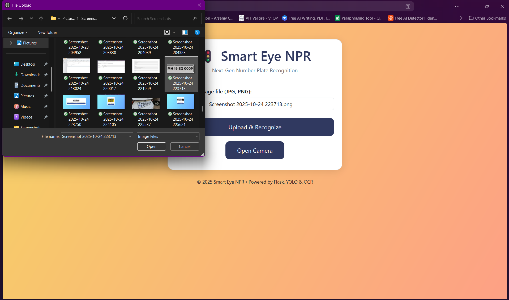
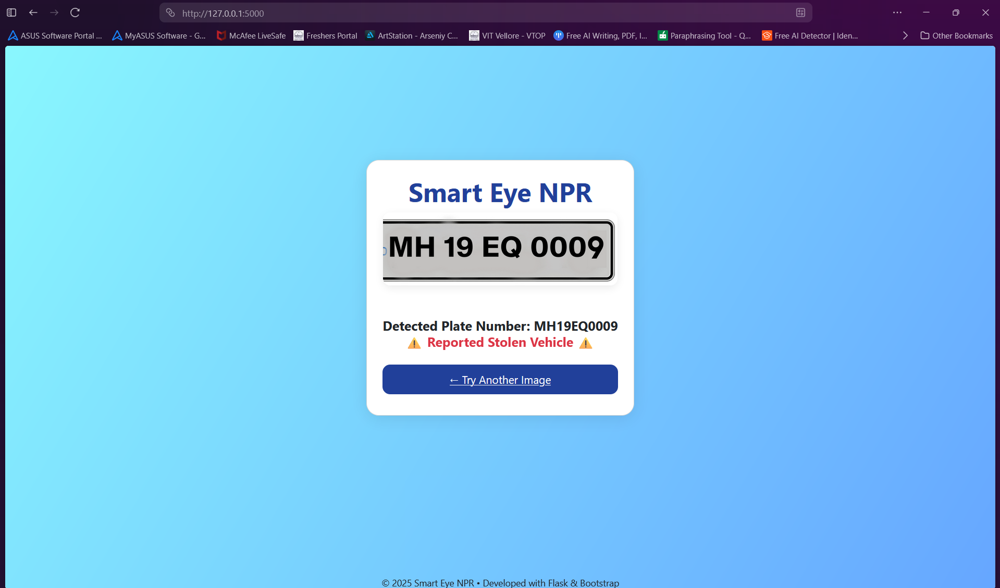
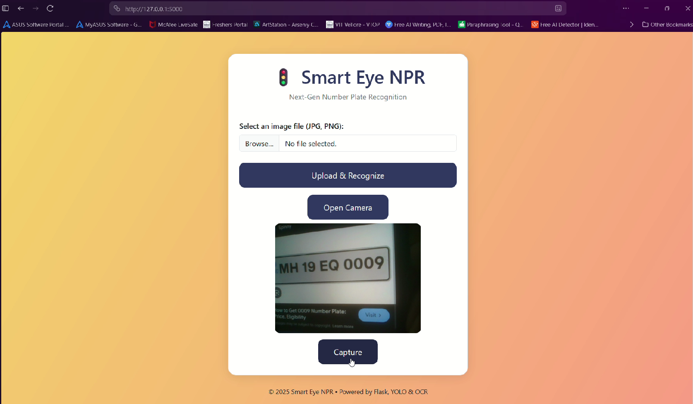
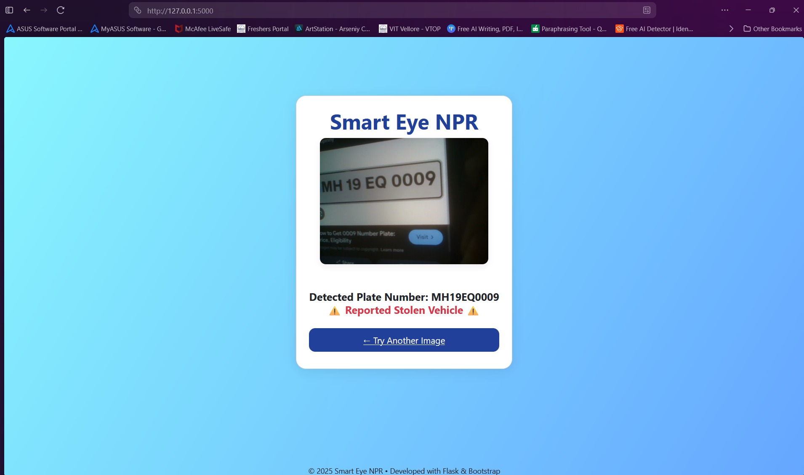
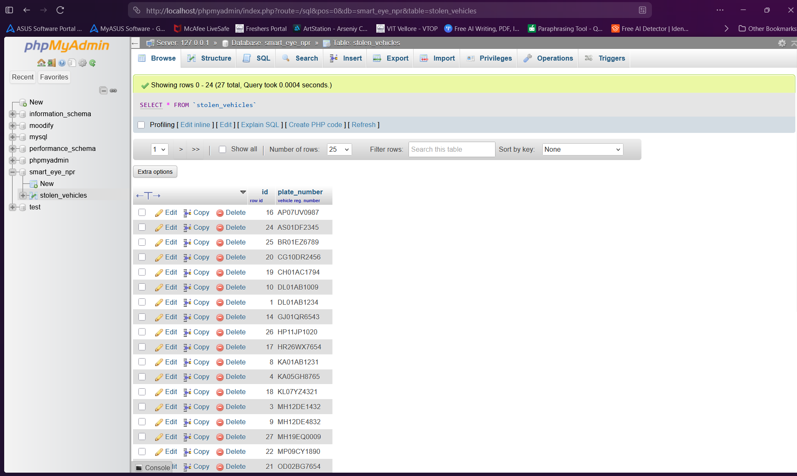

# 🚗 Smart Eye NPR – AI-powered Number Plate Recognition

Welcome to Smart Eye NPR, a Flask-powered web app that detects, reads, and checks vehicle license plates using custom-trained deep learning and real-world logic. Upload a picture, use your camera, and in seconds you'll know if the car is clean—or ⚠️ reported stolen!

---

## 🌟 Highlights

- **Trained YOLOv8 from scratch** on a custom-annotated dataset (thanks Roboflow!).
- Magic OCR with EasyOCR—even from messy or blurry plates!
- Instantly flags stolen vehicles from a real database.
- Upload a photo *or* snap one live with your camera—feel like an undercover agent.
- Beautiful Bootstrap UI for that modern flair.
- Robust Indian plate pattern recognition using regex.

---

## 🚀 Demo

1. Fire up the app.
2. Upload an image or capture using your webcam.
3. Watch as the plate gets detected, read, checked, and classified—all in seconds!
4. Example:

    
    
    
    
    

---

## 🛠 Tech Stack

- Python (Flask)
- YOLOv8 (ultralytics)
- EasyOCR
- Bootstrap
- MySQL
- Jinja2, OpenCV, Pillow

---

## 🧑‍🔬 Custom Dataset

Trained with love!  
- Annotated **hundreds of real-world plates** on Roboflow.
- Exported dataset for robust detection on Indian roads.

---

## ⚡ Try it Yourself

Clone the repo, install requirements, download the model weights, and run:

